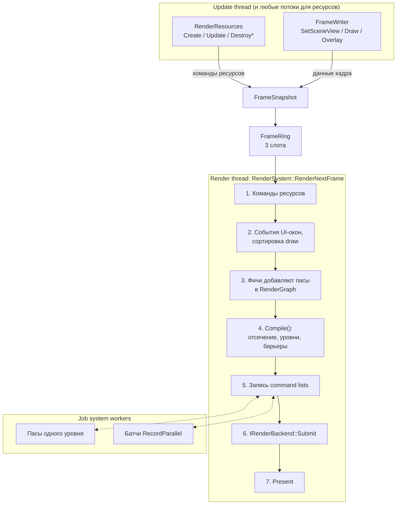

# Архитектура рендера

Рендер работает в отдельном потоке, параллельно с update. Update-поток не вызывает
графический API. Он записывает команды ресурсов ([[RenderResources]]) и заполняет снимок
кадра ([[FrameWriter]] → [[FrameSnapshot]]). Снимок целиком уходит render-потоку через
[[FrameRing]].

Подробно по шагам: [[Кадр на render-потоке]].

## Главные свойства

- **Update и draw работают параллельно.** Update собирает кадр N+1, пока render рисует кадр N
  ([[FrameRing]]).
- **Ресурсы создаются из любого потока.** Хэндл возвращается сразу, команды не теряются и не
  меняют порядок ([[RenderResources]], [[Время жизни ресурсов]]).
- **Пасы объявляют, что читают и пишут.** Граф сам упорядочивает пасы и ставит переходы
  состояний ([[RenderGraph]]).
- **Независимые пасы записываются параллельно** ([[Параллельная запись]]).
- **Бэкенд изолирован.** Выше `rhi::IRenderBackend` нет ни одного типа Diligent ([[Бэкенды]]).

## Слои и каталоги

| Каталог | Содержимое | Графический API |
|---|---|---|
| `render/api/` | [[Хэндлы]], описания ресурсов и пайплайнов, [[RenderResources]], [[FrameWriter]] | нет |
| `render/frame/` | [[FrameSnapshot]], [[FrameRing]] | нет |
| `render/rhi/` | [[CommandList]], [[UploadAllocator]], `IRenderBackend` | нет |
| `render/graph/` | [[RenderGraph]], `PassBuilder`, `PassContext`, пул transient-текстур | нет |
| `render/passes/` | [[Фичи]]: `ScenePass`, `OverlayPass` | нет |
| `render/` | `RenderSystem`, `RenderPipeline`, [[ViewPort]], `OverlayFrame` | нет |
| `render/backend/diligent/` | `DiligentBackend` | **только здесь** |
| `render/backend/null/` | `NullBackend` | — |
| `platform/` | `platform::Window` (GLFW) | — |

Зависимости модуля `render`: публично `core` и `math`, приватно Diligent.

## См. также
- [[Правила потоков рендера]]
- [[Главный цикл]]
- [[Рендер]]
