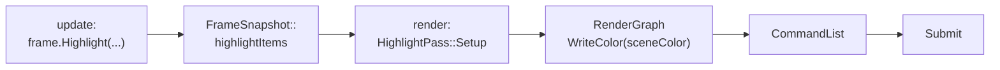

# Пример HighlightPass

Новая [[Фичи|фича]] целиком: подсветка выбранных объектов полупрозрачным цветом поверх сцены.
Используются:
- данные из [[FrameSnapshot#Свои данные для render-потока]] (`highlightItems`);
- существующие шейдеры `mesh.vert.hlsl` и `highlight.frag.hlsl`.

Пример показывает весь путь, а потом можно вернуться к нужной теме:



## Заголовок

```cpp
// render/passes/HighlightPass.hpp
#pragma once
#include "render/passes/IRenderFeature.hpp"

namespace elm::render {
    class HighlightPass final : public IRenderFeature {
    public:
        StringView GetName() const override { return "Highlight"; }
        bool Init(rhi::IRenderBackend& backend) override;
        void Release(rhi::IRenderBackend& backend) override;
        void Setup(RenderGraph& graph, const FrameSnapshot& frame, const rhi::IRenderBackend& backend,
            FrameBlackboard& blackboard) override;
    private:
        PipelineHandle m_pipeline;
    };
}
```

## Init: пайплайн

Подробнее про описание пайплайна — в [[Шейдеры и пайплайны]].

```cpp
// render/passes/HighlightPass.cpp
#include "render/passes/HighlightPass.hpp"
#include "render/frame/FrameSnapshot.hpp"
#include "render/rhi/IRenderBackend.hpp"

namespace elm::render {

namespace {
    struct CameraConstants { Matrix4x4 viewProjection; Vector4 cameraPosition; };
}

bool HighlightPass::Init(rhi::IRenderBackend& backend)
{
    const auto vs = backend.CreateShader({ "Highlight VS", ShaderStage::Vertex, "mesh.vert.hlsl", {} });
    const auto ps = backend.CreateShader({ "Highlight PS", ShaderStage::Pixel, "highlight.frag.hlsl", {} });
    if (!vs || !ps)
        return false;

    PipelineDesc desc;
    desc.name = "Highlight";
    desc.vertexShader = vs;
    desc.pixelShader = ps;
    desc.vertexLayout = {
        { 0, 0, VertexFormat::Float3, false }, { 1, 0, VertexFormat::Float3, false },
        { 2, 0, VertexFormat::Float2, false },
        { 3, 1, VertexFormat::Float4, true }, { 4, 1, VertexFormat::Float4, true },
        { 5, 1, VertexFormat::Float4, true }, { 6, 1, VertexFormat::Float4, true },
        { 7, 1, VertexFormat::Float4, true },
    };
    desc.colorFormat = TextureFormat::RGBA8_UNORM_SRGB;    // формат цвета сцены
    desc.blend = BlendMode::AlphaBlend;                    // без depth: рисуется поверх
    desc.bindings = { { "CameraConstants", ShaderStage::Vertex, BindingType::Constants, sizeof(CameraConstants) } };
    m_pipeline = backend.CreatePipeline(desc);
    return m_pipeline.IsValid();
}

void HighlightPass::Release(rhi::IRenderBackend& backend)
{
    backend.DestroyPipeline(m_pipeline);
    m_pipeline = {};
}
```

## Setup: пас в графе

Как объявлять пасы и что можно захватывать в лямбды, описано в [[RenderGraph]]. Откуда
берётся `sceneColor`, описано в [[Ресурсы графа#Blackboard]].

```cpp
void HighlightPass::Setup(RenderGraph& graph, const FrameSnapshot& frame, const rhi::IRenderBackend&,
    FrameBlackboard& blackboard)
{
    // Нечего рисовать или сцены нет: пас не добавляем вовсе
    if (!m_pipeline || frame.highlightItems.empty() || !blackboard.sceneColor.IsValid())
        return;

    struct Data { RGTexture color; };
    graph.AddPass<Data>("Highlight",
        [&](PassBuilder& builder, Data& data) {
            // Запись в тот же текстурный ресурс, что у ScenePass: граф поставит пас после сцены,
            // а OverlayPass (Read) — после этого паса
            data.color = builder.WriteColor(blackboard.sceneColor);
        },
        [pipeline = m_pipeline](const Data& data, PassContext& context) {
            const auto& frame = context.Frame();
            auto& cmd = context.Commands();
            auto& uploads = context.Uploads();

            constexpr float unused[4] = {};
            cmd.BeginRenderPass(context.ColorTarget(data.color, /*clear*/ false, unused));
            cmd.SetPipeline(pipeline);

            const CameraConstants camera { frame.sceneView.camera.viewProjection,
                Vector4 { frame.sceneView.camera.position, 1.0f } };
            cmd.SetConstants(0, uploads.Upload(rhi::UploadArena::Constants, &camera, 1));

            for (const auto& item : frame.highlightItems) {
                const auto instance = uploads.Upload(rhi::UploadArena::Vertex, &item.instance, 1);
                if (!instance.IsValid())
                    break;
                cmd.BindVertexBuffer(0, rhi::BufferSource::Vertices(item.mesh));
                cmd.BindVertexBuffer(1, rhi::BufferSource::FromUpload(instance));
                cmd.BindIndexBuffer(rhi::BufferSource::Indices(item.mesh));
                cmd.DrawIndexed(0, 1);
            }
            cmd.EndRenderPass();
        });
}

} // namespace elm::render
```

Команды подробно описаны в [[CommandList]], память кадра — в [[UploadAllocator]].

## Подключение

1. Добавить файлы в `src/render/CMakeLists.txt`.
2. Зарегистрировать фичу в `RenderPipeline::Init` между `ScenePass` и `OverlayPass`
   ([[Фичи#Регистрация в RenderPipeline]]).
3. На update-стороне вызывать `frame.Highlight(inst.renderMesh, inst.worldTransform, color)`
   для выбранного объекта ([[FrameWriter]]).

## Проверка

В окне Profiler граф должен показать 3 паса на 3 уровнях: Scene → Highlight → Overlay
([[Отладка рендера]]).
